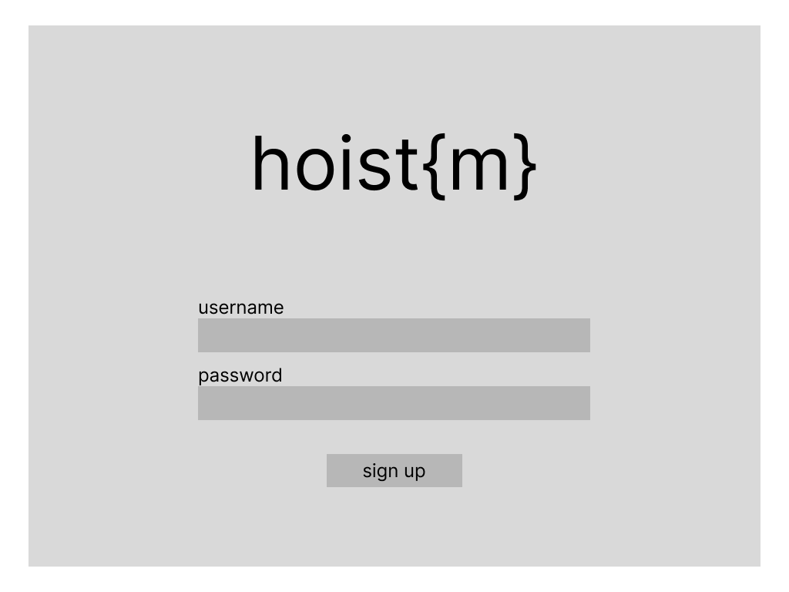
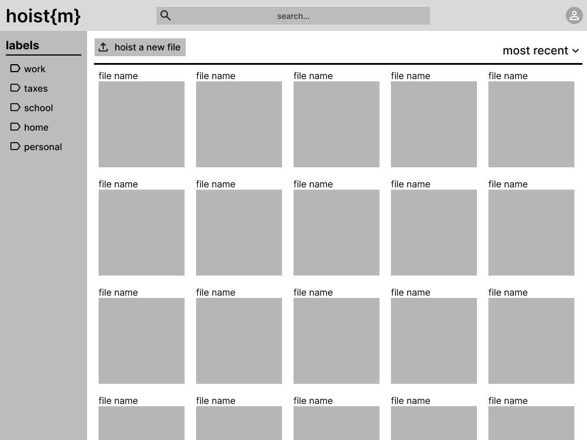
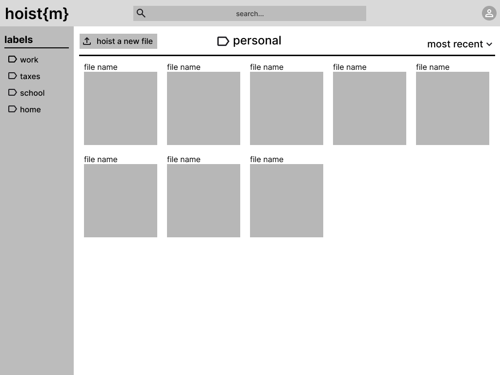
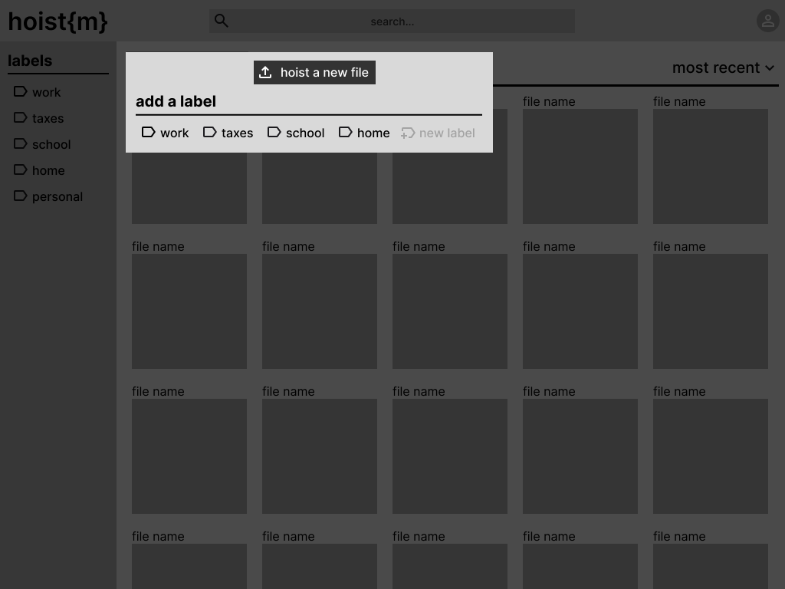
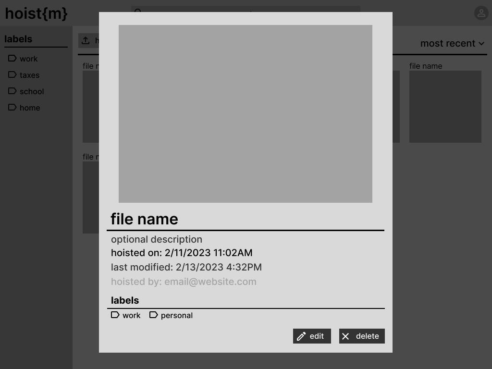
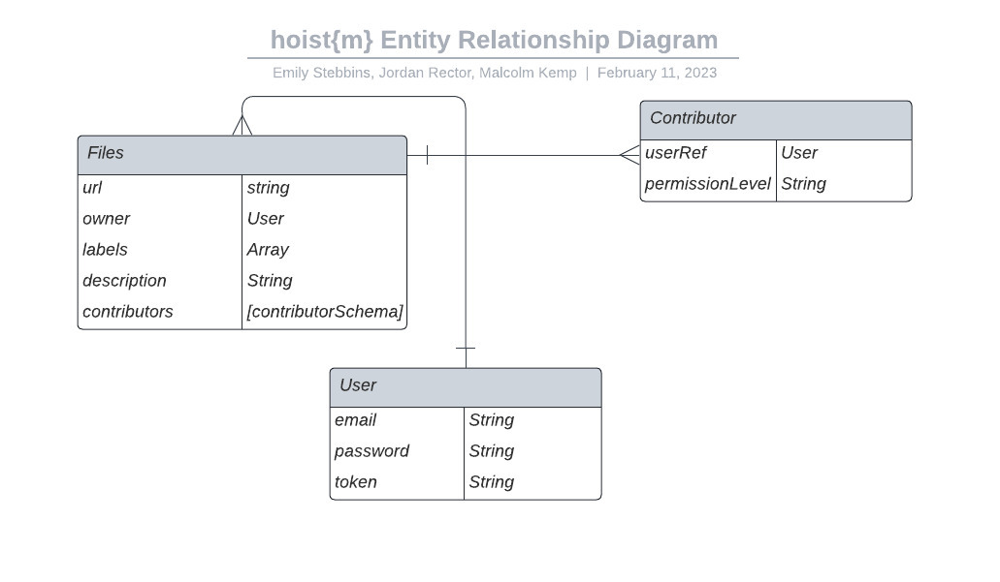

# hoist{m}
## Full-stack Application Project
This is the backend API for the hoist{m} client: https://github.com/estebbins/hoistm-client

## Overview
This app allows users to upload files into a virtual file system. 

### Technologies Used:
- Mongoose
- MongoDb
- Express
- Morgan
- Postman
- bcryptjs
- Reactjs
- AWS S3
- Axios
- JavaScript
- Multer - "node.js middleware for handling multi-part/form-data, which is primarily used for uploading files" [^10]
    - Adds a body object and file(s) object to request body
    - **Must use** enctype="multipart/form-data" in forms
- packages: Node, Nodemon, dotenv, method-override, express-session, connect-mongo

## User stories
- As an unregistered user, I would like to sign up with email and password.
- As a registered user, I would like to sign in with email and password.
- As a signed in user, I would like to change password.
- As a signed in user, I would like to sign out.
- As a signed in user, I would like to upload a file to AWS with a name.
- As a signed in user, I would like to update the name of my file on AWS.
- As a signed in user, I would like to see the all my uploaded files on AWS.
- As a signed in user, I would like to see the preview of all files on AWS.
- As a signed in user, I would like to delete the reference of my file from the database.
- As a signed in user, I would like to see the following data for any file:
    - date created/uploaded
    - date modified
    - owner (user who uploaded the file)
    - name
- As a signed in user, I would like to be able to create and associate custom labels to files
- As a signed in user, I would like to search my files based on data above & custom filters
- As a signed in user, I would like to download files from AWS

### Stretch Goals
- Calendar invites with files attached
- Temporary file-sharing link (to preserve space)
- File owners can add collaborators

## Wireframes/Screenshots

#### Sign Up



#### Index



#### Label



#### Hoist Modal



#### Show Modal



## Entity Relationship Diagram



#### MODEL
| **URL**              | **HTTP Verb** |**Actions**|
|----------------------|---------------|-----------|
| /files/mine         | GET           | index
| /files/:id          | GET           | show
| /files/new          | GET           | new
| /files/new          | POST          | create
| /files/:id/edit     | GET           | edit        |
| /files/:id          | PATCH/PUT     | update      |
| /files/:id          | DELETE        | destroy     |


#### Authentication: Users

| **URL**              | **HTTP Verb** |**Actions**|**Controller#Action**|
|----------------------|---------------|-----------|---------------------|
| /auth/signup         | POST          | new       | users#signup
| /auth/login          | POST          | create    | users#login
| /auth/logout         | DELETE        | destroy   | users#logout        |

## Approach taken
- Our team wanted to learn more about AWS and decided to take on a file storage application as our MERN project.

### Models
#### File Model [^9]
```javascript
const mongoose = require('mongoose')
const contributorSchema = require('./contributor')

const fileSchema = new mongoose.Schema({
    url: {
        type: String,
        required: true
    }, 
    owner: {
		type: mongoose.Schema.Types.ObjectId,
		ref: 'User'
	},
    labels: {
        type: Array,
    },
    description: {
        type: String
    },
    contributors: [contributorSchema]
}, {
  timestamps: true
})

module.exports = mongoose.model('File', fileSchema)
```
- [ ] Add owner to fileSchema?
- [ ] Add labels to fileSchema
```javascript

```
#### Contributors subdocument
```javascript
const mongoose = require('mongoose')

const contributorSchema = new mongoose.Schema({
  userRef: {
    type: mongoose.Schema.Types.ObjectId,
    required: true
  }, 
  permissionLevel: {
    type: String,
    enum: ['read only', 'read and write']
    default: ['read only']
  }
}, {
  timestamps: true
})

module.exports = contributorSchema
```

#### User Model [^9]
```javascript
const mongoose = require('mongoose')

const userSchema = new mongoose.Schema({
  email: {
    type: String,
    required: true,
    unique: true
  },
  hashedPassword: {
    type: String,
    required: true
  },
  token: String
}, {
  timestamps: true,
  toObject: {
    // remove `hashedPassword` field when we call `.toObject`
    transform: (_doc, user) => {
      delete user.hashedPassword
      return user
    }
  }
})

module.exports = mongoose.model('User', userSchema)
```
#### File route (example) [^9]
```javascript
const express = require('express')
const multer = require('multer')
const storage = multer.memoryStorage()
const upload = multer({ storage: storage })
// const customErrors = require('../../lib/custom_errors')
// const handle404 = customErrors.handle404
// const removeBlanks = require('../../lib/remove_blank_fields')
const File = require('../models/file')
const router = express.Router()
const s3Upload = require('../../lib/s3_upload')

router.post('/files', upload.single('file'), (req, res, next) => {
  console.log(req.body.file, req.file)
  s3Upload(req.file)
    .then(s3File => {
      return File.create({
        url: s3File.Location
      })
    })
    .then(file => {
      console.log(file)
      res.status(201).json({ file })
    })
    .catch(next)
})

module.exports = router
```
Example client code [^11]
## Installation instructions
**Using the application**

## Unsolved problems

## Project Requirements
Project 3 overview. [^2]
Project planning guide. [^1]
### MVP
- [ ]A working app, built by the whole team, hosted somewhere on the internet
    - Git Manager: Emily Stebbins - https://github.com/estebbins 
    - Frontend Manager: Jordan Rector - https://github.com/rectorjordan94 
    - Backend Manager: Malcolm Kemp - https://github.com/Malokingsley 
- [ ]A link to your hosted working app in the URL section in each of your Github repos
- [ ]TWO Github repos:
    - one for the API - https://github.com/estebbins/hoistm-api
    - one for the client - https://github.com/estebbins/hoistm-client
    - A team git repository hosted on Github, with a link to your hosted project, and frequent commits from every team member dating back to the very beginning of the project.
- [ ]A readme.md file with:
    - []Include a screenshot of the site in repo's README
    - []Explanations of the technologies used
    - []A couple paragraphs about the general approach you took
    - []Installation instructions for any dependencies
    - []Your user stories – who are your users, what do they want, and why?
    - []Your wireframes – sketches of major views / interfaces in your application - EMBEDDED IN YOUR README
    - []Your ERDS - Entity Relationship Diagrams - EMBEDDED IN YOUR README
    - []Descriptions of any unsolved problems or major hurdles your team had to overcome

#### Technical Requirements
- Build a full-stack application by making your own back-end API and your own front-end client
- Have an interactive front-end, built with react, you can choose to use the boilerplate or create-react-app
- Be a complete product, which means multiple relationships and CRUD functionality for at least a couple models(or subdocuments). You must also either use a third-party API or use seeded data with sufficient quantity/complexity.
- Use a database, use mongoDb via mongoose to save data
- Implement thoughtful user stories that are significant enough to help you know which features to build and which to scrap
- Have a visually impressive design to kick your portfolio up a notch and have something to wow future clients & employers
- Be deployed online so it's publicly accessible (we will discuss in class)

### Project Planning
#### Sprint 1 (Est completion 2/13/23):
- [ ] Develop project pitch (2/10/23-2/13/23)
- [ ] Determine team roles & resposibilities
- [x] Test team git workflows [^8]
- [ ] Create README.md file with project plannings steps
- [ ] Gain project approval (2/13/23)

**Sprint 2 (Est completion 2/13/23):**
- [ ] Review react-auth-boilerplate documentation [^5]
- [ ] Review mongoose-express-auth-API-boilerplate documentation [^4]
- [ ] Follow boilerplate installation instructions
- [ ] Install other dependencies as needed
- [ ] Research AWS-S3 set-up guide [^3]
- [ ] Research multer middleware package [^10]
- [ ] Ensure API functioning properly from template
- [ ] Begin model 1 build 
- [ ] Seed database and/or incoporate API
- [ ] Create Index & Show Routes & test in Postman

**Sprint 3 (Est completion 2/14/23):**
- [ ] Adjust seed route to script if necessary
- [ ] Create user model (in boilerplate)
- [ ] Complete model 1 5 RESTful routes & test in Postman 
- [ ] Create model 2/subdocument
- [ ] Create user & model 2 routes, and test in Postman
- [ ] Confirm back-end development working without unnecessary bugs

**Sprint 4 (Est completion 2/15/23):**
- [ ] Complete liquid views
- [ ] Enhance styling of pages, get feedback
- [ ] Update responses & error handling for liquid views
- [ ] Conduct extensive views testing & ensure DB connection intact
- [ ] Evaluate readiness for deployment
- [ ] Merge development branch(s) as needed with main

**Sprint 5 (Est completion 2/16/23):**
- [ ] Deploy application
- [ ] Conduct extensive testing
- [ ] Conduct user acceptance testing
- [ ] Address bugs, errors, feedback
- [ ] Update README.md with all necessary requirements & information
- [ ] Confirm all technical requirements & MVP completion
- [ ] Submit project 2 per submission instructions

**Final Deliverable (Est completion 2/21/23):**
- [ ] Present deliverable to SEI Cohort & Instructors
- [ ] Update documentation to incorporate feedback and development opportunities

**Media sources**


[^1]: https://git.generalassemb.ly/sei-ec-remote/planning-projects
[^2]: https://git.generalassemb.ly/sei-ec-remote/project_3
[^3]: https://git.generalassemb.ly/sei-ec-remote/aws-s3-setup-guide
[^4]: https://git.generalassemb.ly/sei-ec-remote/mongoose-express-auth-API-boilerplate
[^5]: https://git.generalassemb.ly/sei-ec-remote/react-auth-boilerplate
[^6]: Used Figma to create wireframes
[^7]: used Lucid Chart to develop the final ERD. Figma for original (in assets folder)
[^8]: https://git.generalassemb.ly/sei-ec-remote/git-team-workflow
[^9]: https://git.generalassemb.ly/sei-ec-remote/c2c-image-upload-api/tree/training
[^10]: https://expressjs.com/en/resources/middleware/multer.html
[^11]: client example code: https://git.generalassemb.ly/sei-ec-remote/c2c-image-upload-client/tree/c2c-training 

Color pallette guide: https://icolorpalette.com/download/palette/446754_color_palette.jpg 

