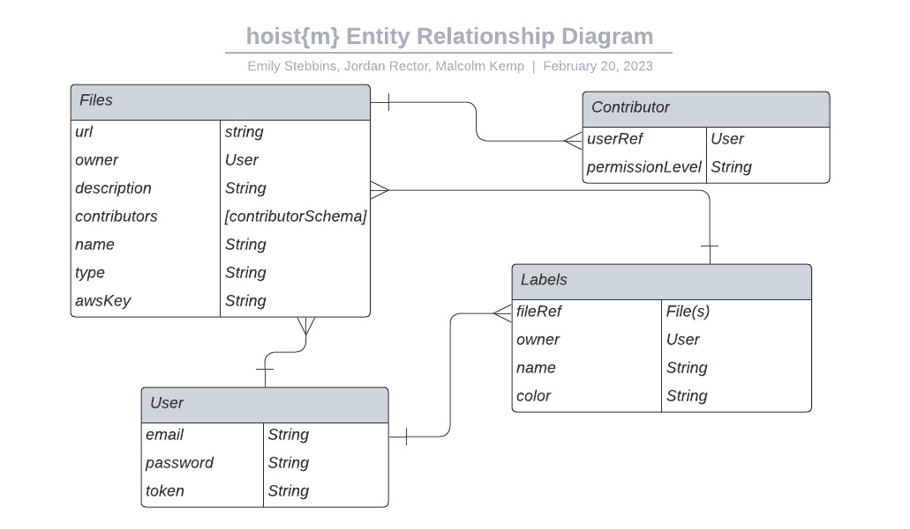

# hoist{m}
Creators: Malcolm Kemp, Jordan Rector, Emily Stebbins
## Full-stack Application Project
This is the backend API for the hoist{m} client: https://github.com/estebbins/hoistm-client

## Overview
This app allows users to upload files into a virtual file system where the user can search and filter their files. Users can create custom labels as the singular & simple method for file organization. This is a full-stack MERN app using AWS S3 cloud storage and Multer middleware for file upload. This app features user authentication, encryption for file uploads, and file owners can control contributor access and rights.

### Technologies Used:
- Mongoose
- MongoDb
- Express
- Morgan
- Postman
- bcryptjs
- Reactjs
- AWS S3
- Axios
- JavaScript
- Multer - "node.js middleware for handling multi-part/form-data, which is primarily used for uploading files" [^10]
    - Adds a body object and file(s) object to request body
    - **Must use** enctype="multipart/form-data" in forms
- packages: Node, Nodemon, dotenv, method-override, express-session, connect-mongo

## User stories
- As an unregistered user, I would like to sign up with email and password.
- As a registered user, I would like to sign in with email and password.
- As a signed in user, I would like to change password.
- As a signed in user, I would like to sign out.
- As a signed in user, I would like to upload a file to AWS with a name.
- As a signed in user, I would like to update the name of my file on AWS and add/edit its description.
- As a signed in user, I would like to see the all my uploaded files on AWS.
- As a signed in user, I would like to see the preview of all files on AWS.
- As a signed in user, I would like to delete the reference of my file from the database.
- As a signed in user, I would like to see the following data for any file:
    - date created/uploaded
    - date modified
    - owner (user who uploaded the file)
    - name
    - description
    - contributors attached
    - labels associated
- As a signed in user, I would like to be able to create and associate custom labels to files
- As a signed in user, I would like to download files from AWS
- As a signed in user, I would like to filter my files based on custom labels

## Wireframes/Screenshots

## Entity Relationship Diagram


## Unsolved problems/Next Version Notes
- The token field should be disabled for contributors
- AWS capacity/file size might need to be updated - 
- File size above 120MB may cause crash of app - can resolve through AWS
- AWS Bucket Capacity is 5GB
- Bucket configuration steps need to be added to READMe
- Curl scripts to be updated

## Installation instructions
Developers - once repo forked/cloned, run npm install to install dependencies, will need AWS Secrets (.env file) from original developers

#### Route Tables

##### Files
| **URL**             | **HTTP Verb** |**Actions**|
|---------------------|---------------|-----------|
| /files              | GET           | index
| /files/:id          | GET           | show
| /files/             | POST          | create/upload
| /files/:id          | PATCH         | update      
| /files/:id          | DELETE        | destroy     
| /files/download/:id | GET           | download     

##### Authentication: Users
| **URL**              | **HTTP Verb** |**Actions**|**Controller#Action**|
|----------------------|---------------|-----------|---------------------|
| /auth/signup         | POST          | new       | users#signup
| /auth/login          | POST          | create    | users#login
| /auth/logout         | DELETE        | destroy   | users#logout        

##### Labels
| **URL**                  | **HTTP Verb** |**Actions**|
|--------------------------|---------------|-----------|
| /filelabels/:fileId      | GET           | index/filter
| /labels                  | GET           | index
| /labels/:id              | GET           | show
| /labels                  | POST          | create
| /labels/:lableIid/:fileId| PATCH         | update/add file      
| /labels/:labelId/:fileId | PATCH         | update/remove file     
| /labels/:id              | PATCH         | update    
| /labels/:id              | DELETE        | destroy     

##### Contributors
| **URL**                              | **HTTP Verb** |**Actions**|
|--------------------------------------|---------------|-----------|
| /contributors/:filter                | GET           | index/filter
| /contributors/:fileId                | POST          | create/add to file
| /contributors/:fileId/:contributorId | PATCH         | update  
| /contributors/:fileId/:contributorId | DELETE        | destroy  

### Models
#### File Model [^9]
```javascript
const fileSchema = new mongoose.Schema({
    url: {
        type: String,
        required: true
    }, 
    name: {
        type: String,
        required: true
    },
    type: {
        type: String,
        required: true
    },
    owner: {
		type: mongoose.Schema.Types.ObjectId,
		ref: 'User'
	},
    description: {
        type: String
    },
    awsKey: {
        type: String,
    },
    contributors: [contributorSchema]
}, {
    timestamps: true
})
```

#### Contributors subdocument
```javascript
const contributorSchema = new mongoose.Schema({
  userRef: {
    type: mongoose.Schema.Types.ObjectId,
    ref: 'User',
    required: true
  }, 
  permissionLevel: {
    type: String,
    enum: ['read only', 'read and write'],
    default: 'read only',
    required: true
  }
}, {
  timestamps: true
})
```

#### User Model [^9]
```javascript
const userSchema = new mongoose.Schema({
  email: {
    type: String,
    required: true,
    unique: true
  },
  hashedPassword: {
    type: String,
    required: true
  },
  token: String
}, {
  timestamps: true,
  toObject: {
    // remove `hashedPassword` field when we call `.toObject`
    transform: (_doc, user) => {
      delete user.hashedPassword
      return user
    }
  }
})
```

#### Label Model [^9]
```javascript
const labelSchema = new mongoose.Schema({

    owner: {
		type: mongoose.Schema.Types.ObjectId,
		ref: 'User'

	},
    fileRef: [{
        type: mongoose.Schema.Types.ObjectId,
        ref:'File'
    }],
    name: {
        type: String, 
        required: true
    },
    color: {
        type: String, 
        required: true
    },
},
{
  timestamps: true
}
)
```

Example client code [^11]

## Project Requirements
Project 3 overview. [^2]
Project planning guide. [^1]
### MVP
- [x] A working app, built by the whole team, hosted somewhere on the internet
    - Git Manager: Emily Stebbins - https://github.com/estebbins 
    - Frontend Manager: Jordan Rector - https://github.com/rectorjordan94 
    - Backend Manager: Malcolm Kemp - https://github.com/Malokingsley 
- [x] A link to your hosted working app in the URL section in each of your Github repos
- [x]TWO Github repos:
    - one for the API - https://github.com/estebbins/hoistm-api
    - one for the client - https://github.com/estebbins/hoistm-client
    - A team git repository hosted on Github, with a link to your hosted project, and frequent commits from every team member dating back to the very beginning of the project.
- [x] A readme.md file with:
    - [x]Include a screenshot of the site in repo's README
    - [x]Explanations of the technologies used
    - [x]A couple paragraphs about the general approach you took
    - [x]Installation instructions for any dependencies
    - [x]Your user stories – who are your users, what do they want, and why?
    - [x]Your wireframes – sketches of major views / interfaces in your application - EMBEDDED IN YOUR README
    - [x]Your ERDS - Entity Relationship Diagrams - EMBEDDED IN YOUR README
    - [x]Descriptions of any unsolved problems or major hurdles your team had to overcome

#### Technical Requirements
- Build a full-stack application by making your own back-end API and your own front-end client
- Have an interactive front-end, built with react, you can choose to use the boilerplate or create-react-app
- Be a complete product, which means multiple relationships and CRUD functionality for at least a couple models(or subdocuments). You must also either use a third-party API or use seeded data with sufficient quantity/complexity.
- Use a database, use mongoDb via mongoose to save data
- Implement thoughtful user stories that are significant enough to help you know which features to build and which to scrap
- Have a visually impressive design to kick your portfolio up a notch and have something to wow future clients & employers
- Be deployed online so it's publicly accessible (we will discuss in class)

### Project Planning
#### Sprint 1 (Est completion 2/13/23):
- [x] Develop project pitch (2/10/23-2/13/23)
- [x] Determine team roles & resposibilities
- [x] Test team git workflows [^8]
- [x] Create README.md file with project plannings steps
- [x] Gain project approval (2/13/23)

#### Sprint 2 (Est completion 2/13/23):
##### Backend - M
- [x] Review mongoose-express-auth-API-boilerplate documentation - M [^4]
- [x] Follow boilerplate installation instructions - J/M/E
- [x] Install other dependencies as needed - All
- [x] Research AWS-S3 set-up guide - M [^3]
- [x] Research multer middleware package - E [^10]
- [x] Create models & subdocuments 
- [x] Seed database and/or incoporate API
- [x] Build Create, Index & Show Routes & test in Postman
- [x] Modify create route to connect to AWS
##### Frontend - J
- [x] Review react-auth-boilerplate documentation - J [^5]
- [x] Follow boilerplate installation instructions - J/M/E
- [x] Install other dependencies as needed - All

#### Sprint 3 (Est completion 2/15/23):
##### Backend - M
- [x] AWS Update & Delete route updates
- [x] Complete file RESTful routes & test in Postman 
- [x] Confirm back-end development working without unnecessary bugs
##### Frontend - J
- [x] FileIndex component
- [x] ShowFile component
- [x] CreateFile component
- [x] EditFile component

#### Sprint 4 (Est completion 2/15/23):
##### Frontend - J
- [x] Build label component
- [x] Filters component
- [x] Enhance styling of pages, get feedback 
- [x] Update responses & error handling
- [x] Conduct extensive testing & ensure DB connection intact
- [x] Evaluate readiness for deployment
- [x] Merge development branch(s) as needed with main

##### Sprint 5 (Est completion 2/16/23):
- [x] Deploy application
- [x] Conduct extensive testing
- [x] Conduct user acceptance testing
- [x] Address bugs, errors, feedback
- [x] Update README.md with all necessary requirements & information
- [x] Confirm all technical requirements & MVP completion
- [x] Submit project 2 per submission instructions

#### Final Deliverable (Est completion 2/21/23):
- [ ] Present deliverable to SEI Cohort & Instructors
- [ ] Update documentation to incorporate feedback and development opportunities


[^1]: https://git.generalassemb.ly/sei-ec-remote/planning-projects
[^2]: https://git.generalassemb.ly/sei-ec-remote/project_3
[^3]: https://git.generalassemb.ly/sei-ec-remote/aws-s3-setup-guide
[^4]: https://git.generalassemb.ly/sei-ec-remote/mongoose-express-auth-API-boilerplate
[^5]: https://git.generalassemb.ly/sei-ec-remote/react-auth-boilerplate
[^6]: Used Figma to create wireframes
[^7]: used Lucid Chart to develop component diagram, ERD
[^8]: https://git.generalassemb.ly/sei-ec-remote/git-team-workflow
[^9]: https://git.generalassemb.ly/sei-ec-remote/c2c-image-upload-api/tree/training
[^10]: https://expressjs.com/en/resources/middleware/multer.html
[^11]: client example code: https://git.generalassemb.ly/sei-ec-remote/c2c-image-upload-client/tree/c2c-training 

Color pallette guide: https://icolorpalette.com/download/palette/446754_color_palette.jpg 
